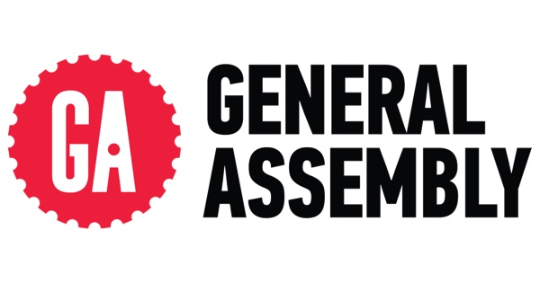

# FEWD2 Course Repository
Welcome to Front-End Web Development (FEWD) at General Assembly! This is where we will be hosting all class slides, assignments, starter code, and more.

## Communication
General Assembly's gives every class its own Slack chatroom - here is ours: [FEWD 2 Slack Channel](https://fewddc41.slack.com). It's the best way to get ahold of your instructors. You should have received an invitation but if not, let Marc know and we can get you in there.

Slack is channel based; if you have questions that would benefit everyone, ask them in the *#general* channel. Missing class? Of course not, but give us a heads up in *#missing-class*. We'll also post useful resources in *#useful-resources*. You can also contact instructors, TAs and classmates directly using the tool.

## Tools and Resources
During this course, there are a number of tools you will be expected to have and others we think you'll want to have. Have a look:

### Required Tools
* [Slack](https://slack.com/downloads) - Desktop application for our class chatroom (**please disable audio notifications!**).
* [Sublime Text](http://www.sublimetext.com/3) - Text editor with syntax highlighting and autocompletion.
* [Github Desktop](https://desktop.github.com/) - Desktop application for Github.
* [Chrome Browser](https://www.google.com/chrome/browser/desktop/) - Default browser for the class.

### Recommended Tools
* [Codepen](https://codepen.io) - Do front-end development in the browser! We'll also be showing you many live examples in Codepen so it would be good to at least familiarize yourself with it if you don't plan on signing up.
* [VS Code](https://code.visualstudio.com/) - My favorite text editor at the moment, really good for front-end dev.
* [Dashlane](https://dashlane.com) - My favorite password management tool. Get used to saving passwords if you want to be a professional front-end dev.
* [Trello](https://trello.com) - The best task management tool on the internet. This would be a great way for you to organize your final project.

### Resources
* [Mozilla Developer Network](https://developer.mozilla.org/en-US/) - Web Platform documentation.
* [Stack Overflow](http://stackoverflow.com/) - Question/Answer site focused on programming.
* [Sublime Text Cheat Sheet](http://www.cheatography.com/martinprins/cheat-sheets/sublime-text-3-osx/) - Shortcuts and customizations with Sublime Text.
* [CSS-tricks.com](https://css-tricks.com) - Best guide on CSS best practices on the internet.
* [CanIUse.com](http://caniuse.com/) - Guide to what features work in which browsers. It is focused on the latest extensions of HTML, CSS and JS but will help you get a sense of what is possible in each browser.
* [HTML5 Validator](https://html5.validator.nu/) - Validate HTML5 source for verifying conformance.
* [Sip](https://itunes.apple.com/us/app/sip/id507257563?mt=12) - Grab colors off your screen to use in CSS.

## Meet the Team
### John Serrao (Lead Instructor)
John is a displaced Texan who's been up in the national capital leading large-scale web development projects for the last ten years. His interests in this field are focused on improving user experience in scalable web applications that address real-world needs. One of his longer-term goals is to unite the worlds of medicine and agriculture with scalable, technological solutions that dramatically bring down the cost of quality food and help reverse the trend of chronic disease in the United States. **If you've got a question, and you're not sure who to ask, start with Marc!**

### Eva Lai (Teaching Assistant)
Eva is a graduate of General Assembly's Web Development Immersive. After 3+ years of working on the strategy end of IT transformation, she discovered she had a bigger passion for the technical side which eventually led her to pursue a career pivot into the development. Her passions include Javascript (yes!), Drupal and other fun technical stuff.

### David Allison (Course Producer)
All questions concerning enrollment/payment, or subjects you would prefer not to discuss with the instructional team, should be addressed to David Allison (our course producer) at: david.allison@generalassemb.ly
